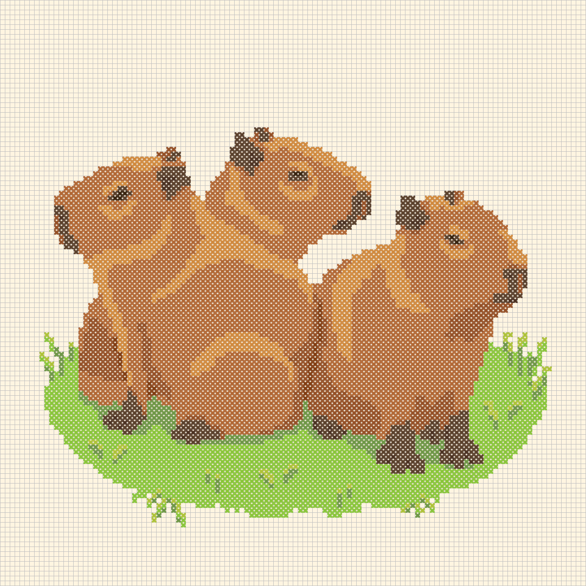
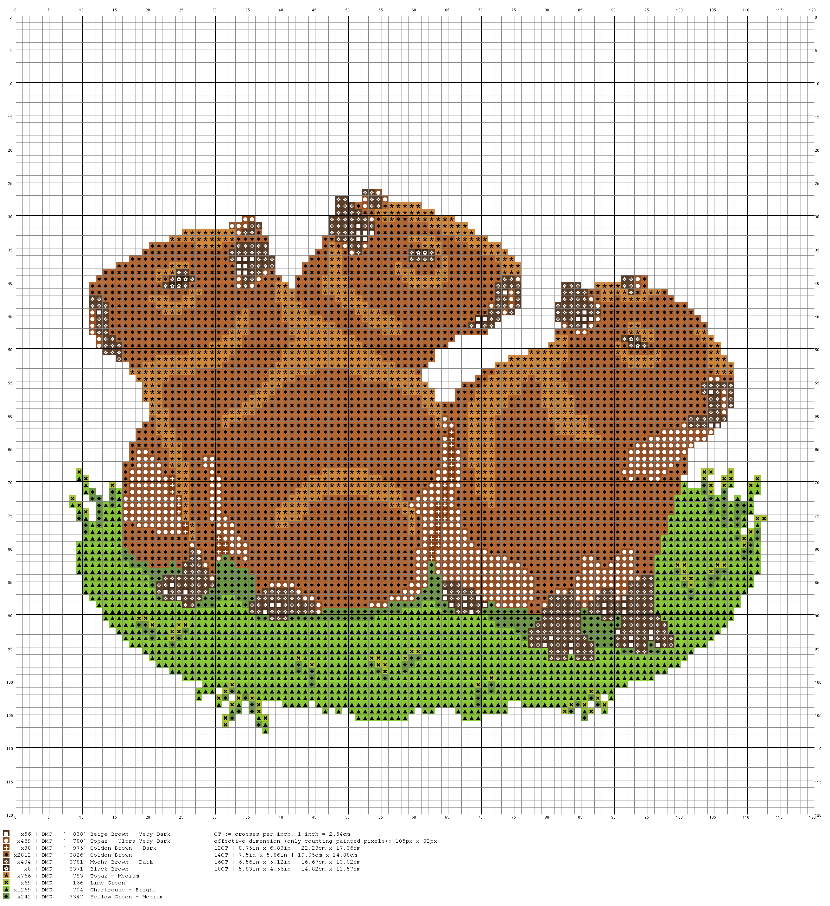

# What does it do?
'pixelcross' is a open source project which implements a Command Line Interface (CLI) program which you can use to generate a crossstitch pattern image from your pixel art image.
The program will determine for each pixel the yarn with the approximately closest color and render a crossstitch pattern using those yarns. The yarn sortiments can be configured including their RGB pixel color representation.

In short - go from this:


To this:



And more importantly this:



# What does it not do?
'pixelcross' does provide no graphical user interface (GUI). It also does not reduce the amount of colors in your image nor does it resize the image. Reason being there is enough free software to edit and adjust images which you could use for that purpose and than process the result with 'pixelcross'.

# Why does this exist?
Pixel art is cool.

Cross stitching is cool.

I do not want to pay around 50$ for proprietary software, which does the same thing but is awkward to use.

Why not?

# How to install?
* Install Java
	* Java Programs require a runtime environment called JRE to be executed. For example you could download the Adoptium OpenJDK Java from this [site](https://adoptium.net/de/temurin/releases/), simply pick the JRE which matches your system. For example 'Windows | x64 | JRE 21 - LTS' and install either via msi or download the zip container, unpack it where you want and add the bin directory to your Path environment variable.
Since this is about the 'PixelCross' application, I do not really want to got into this in further detail. 
* Download pixelcross release package
* Unpack pixelcross release package (zip or tar.gz)
* Go into the unpacked directory
* Open console
	* On windows simply click into the field in the explorer which shows the directory path, type CMD and hit enter, that opens the command prompt in the directory.
* Run command explained under 'How to run?'


# How to run?
```
java -jar pixelcross-0.1.0-SNAPSHOT-jar-with-dependencies.jar <pixelArtImagePath>
```

*<pixelArtImagePath>* needs to be replaced with the path to the pixel art image you want to create a pattern for.

This means you need an installed Java Runtime Environment (JRE) or Java Development Kit (JDK) for Java 21 or later versions. Which you have to put on your Path environment variable.

Alternatively you can call the 'java' program directly:

* Windows example:
```
C:\Program Files\Java\jdk-21.0.3+9\bin\java.exe -jar pixelcross-0.1.0-SNAPSHOT-jar-with-dependencies.jar <pixelArtImagePath>
```

* Linux (Ubuntu) example:
```
/usr/lib/jvm/jdk-21.0.3+9/bin/java -jar pixelcross-0.1.0-SNAPSHOT-jar-with-dependencies.jar <pixelArtImagePath>
```

# What can be configured?
Currently you can only specify on the CLI the path to the pixelart file you want to create a pattern for.
However the program reads in the config file 'config/pixelcross.config.xml'. The yarn sortiments used by the application can be configured via this file. That means if you want to add yarns, sortiments or if you want to change the RGB value of a yarn you can do this by editing this config file.
The current yarn sortiment is taken from [Lord Libidan - DMC Thread Inventory Spreadsheet](https://lordlibidan.com/dmc-thread-inventory-spreadsheet/). I only wrote a script to convert the spreadsheet into an XML format. This means I can not guarantee that all RGB colors are a good fit for the actual yarn color. That being said, the spreadsheet looks accurate. In any case you shoul double check the color of the yarn when buying it and not blindy follow the suggestions of this application.

# Plans for the future?
Currently I am improving my cross stitching and thus do not plan immediate improvements to this project.
If you have any feature requests let me know, I might implement them.

Ideas for possible future features:
* add a graphical user interface (GUI)
* make the result file paths configurable
	* add a timestamp or UUID to them to prevent overwriting of existing files
* add tests ... probably ... maybe ...
* ...


# How to build?
'pixelcross' is a Java program using maven as a build tool, hence you can build the project via the following command (assuming you installed maven (aka 'mvn')):
```
mvn clean install
```